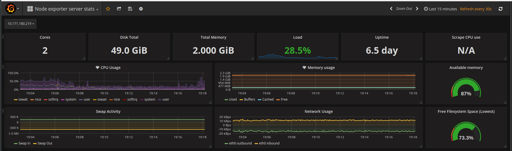
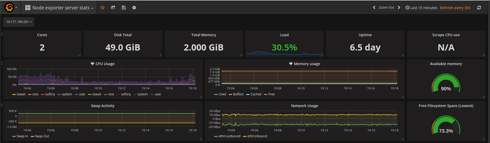
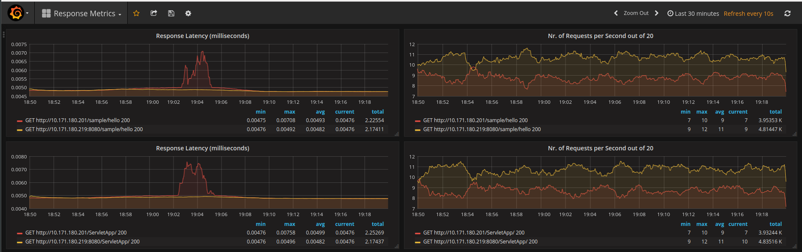

# Tomcat vs. WAS Liberty

Both solutions were installed on LXD which offers a user experience similar to virtual machines but using Linux containers instead.

## Setup
 - Tomcat:
   - package: `apache-tomcat-8.5.20.tar.gz`
   - instructions: `tomcat-lxd.md` file
 - WAS Liberty:
   - package: `wlp-webProfile7-java8-linux-x86_64-17.0.0.2.zip`
   - instructions: `wlp-lxd.md` file
 - Prometheus Setup:
   - Prometheus: `prometheus-1.7.1.linux-amd64.tar.gz`
   - Grafana: `grafana-4.4.3.linux-x64.tar.gz`
   - Node-Exporter: `node_exporter-0.14.0.linux-amd64.tar.gz`
   - Probe App: `tomcat-vs-was-liberty/probe_urls.go`
   - instructions: `tomcat-vs-was-liberty/prometheus-setup-wlp-tomcat.md`


## Summary

- Both application servers were deployed in it's own Linux container (LXD) and limited to use 2 CPU's + 2GB of RAM.
- On both WLP and Tomcat it was deployed the same .war's files. One was obtained from the apache tomcat server (/sample/hello), and the second from WLP sample (/ServletApp/).
- 2 Requestor instance one for each sample
- For metrics, node-exporter installed on each container fore server metrics, Prometheus and Grafana on the localhost.

### Test Setup Diagram

- Prometheus, used to scrape and store metrics in a timeseries database.
- Grafana, used to visualize the data from Prometheus
- Requestor, small App written in golang used to send 20 concurrent requests to
application server endpoints in a 1 second interval in order to avoid Distributed Denial of Service detection.


### Application Server Resource Usage

Output from node-exporter-server-stats, dashboard downloaded from grafana.net

- Tomcat




- WAS Liberty




### Response metrics

The test was performed using 4 concurrent workers (subprocess) to probe 2 URLS in a total a 20 request repeated every second.
- Tomcat `http://10.171.180.219:8080/sample/hello`
- WAS `http://10.171.180.201/sample/hello`

WLP is a few milliseconds slower in response time, and being a concurrent setup, the workers ended up probing the Tomcat url with more requests.



Response Duration Prometheus query (milliseconds).
This query will output 95% of requests calculated over a 5 minutes time period (SLA 95 %).
```
histogram_quantile(0.95, sum(rate(http_request_duration_milliseconds_bucket[5m])) by (le,url,method))

```

Query number of requests and rate them on a 30s period.
```
rate(http_request_duration_milliseconds_count[1m])
```
